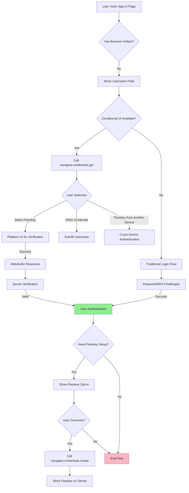

# POC 1: Passkey Authentication Flow

This diagram illustrates the authentication flow using passkeys, including fallback options and the passkey setup process.

```mermaid
flowchart TD
    A[User Visits Sign-in Page] --> B{Has Browser Artifact?}
    B -->|No| C[Show Username Field]
    
    C --> D{Conditional UI Available?}
    D -->|Yes| E[Call navigator.credentials.get]
    D -->|No| F[Traditional Login Flow]
    
    E --> G{User Selection}
    G -->|Select Passkey| H[Platform UI for Verification]
    G -->|Other Credential| I[Autofill Username]
    G -->|Passkey from Another Device| J[Cross-Device Authentication]
    
    H -->|Success| K[WebAuthn Response]
    K --> L[Server Verification]
    L -->|Valid| M[User Authenticated]
    
    F --> N[Password/MFA Challenges]
    N -->|Success| M
    
    M --> O{Need Passkey Setup?}
    O -->|Yes| P[Show Passkey Opt-in]
    
    P --> Q{User Consents?}
    Q -->|Yes| R[Call navigator.credentials.create]
    R --> S[Store Passkey on Server]
    
    Q -->|No| T[End Flow]
    O -->|No| T

    style M fill:#90EE90
    style T fill:#FFB6C1
```
